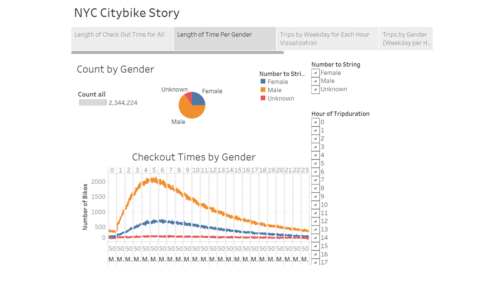
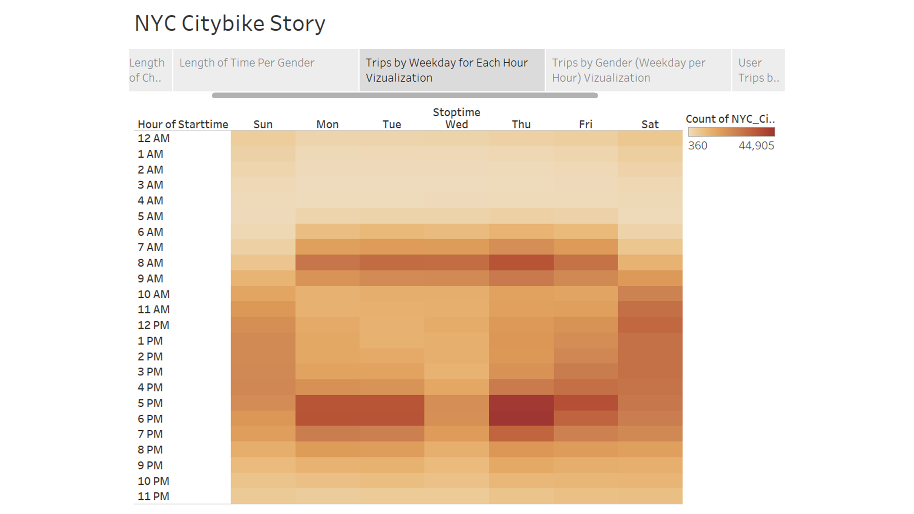
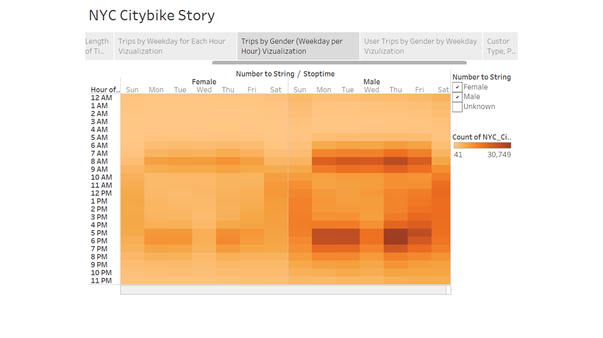
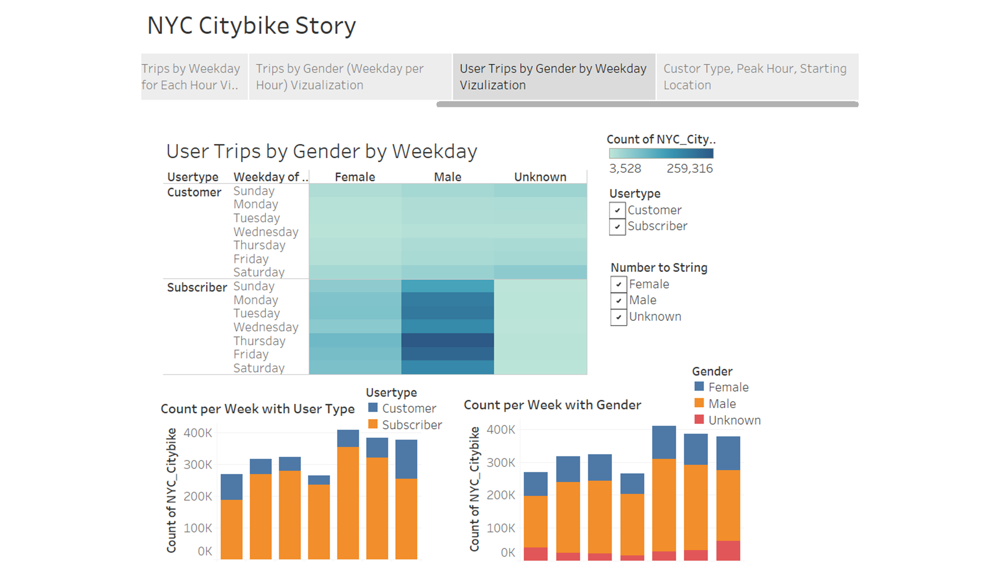

# Tableau_Bikesharing

Creating Tableau Dashboards and stories about NYC Citi Bike in order to make a solid business proposal of a bike-sharing program in Des Moines city, Iowa.

## Tableau Public Website
[Tableau_Public_Sungil Baik](https://public.tableau.com/profile/sungil.baik#!/vizhome/NYC_Citibike_Challenge_16084077890610/Story1?publish=yes)

## Background

As the new lead analyst for the [New York Citi Bike](https://en.wikipedia.org/wiki/Citi_Bike) Program, you are now responsible for overseeing the largest bike sharing program in the United States. In your new role, you will be expected to generate regular reports for city officials looking to publicize and improve the city program.
Herein, we'll work with data visualization software called Tableau to present a business proposal for a bike-sharing company. First, we'll learn how to import, style, and portray data accurately. Then, we'll create worksheets, dashboards, and stories to visualize key data from a New York Citi Bike dataset.

## Objective and Goal

 - Import data into Tableau.
 - Create and style worksheets, dashboards, and stories in Tableau.
 - Use Tableau worksheets to display data in a professional way.
 - Portray data accurately using Tableau dashboards.

## Software/Tools
* Tableau, VS Code, Jupyter Notebook, Pandas, Github
* The data is provided [Citi Bike Data](https://www.citibikenyc.com/system-data) webpage.

## Tasks

**Using Tableau we visualize in many aspect.**
 * Determine the Number of Trips
 * Find the Proportion of Short Term Customers to Annual Subscribers
 * Find the Peak Riding Hours in August
 * Find Top Starting and End Locations
 * Find the Number of Rides by Gender
 * Find the Average Trip Duration by Age
 * Determine the Bikes Due for Repair
 * Determine Bike Utilization
 * Few tasks are summurized in the following dashboard.

## Challenge

From the analysis, we’ll use Pandas to change the "tripduration" column from an integer to a datetime datatype. Then, using the converted datatype, you’ll create a set of visualizations to: (1) Show the length of time that bikes are checked out for all riders and genders (2) Show the number of bike trips for all riders and genders for each hour
of each day of the week, (3) Show the number of bike trips for each type of user and gender for each day of the week, (4) Finally, you’ll add these new visualizations to the two you created in this module for your final presentation and analysis to pitch to investors.

* Change Trip Duration to a Datetime Format
Using Python and Pandas functions, you’ll convert the "tripduration" column from an integer to a datetime datatype to get the time in hours, minutes, and seconds (00:00:00). After you convert the "tripduration" column to a datetime dataytpe, you’ll export the DataFrame as a CSV file.

* Create Visualizations for the Trip Analysis
(1) Create the Checkout Times for Users Visualization

(2) Create the Checkout Times by Gender Visualization

(3) Create the Trips by Weekday for Each Hour Visualization

(4) Create the Trips by Gender (Weekday per Hour) Visualization

(5) Create the User Trips by Gender by Weekday Visualization

* A static map that plots all bike stations with a visual indication of the most popular locations to start and end a journey with zip code data overlaid on top.

* If you're working with a merged dataset: a dynamic map that shows how each station's popularity changes over time (by month and year) -- with commentary pointing to any interesting events that may be behind these phenomena.

**Lastly, as a chronic over-achiever:**

* Find at least two unexpected phenomena in the data and provide a visualization and analysis to document their presence. 

## Considerations

Remember, the people reading your analysis will NOT be data analysts. Your audience will be city officials, public administrators, and heads of New York City departments. Your data and analysis needs to be presented in a way that is focused concise, easy-to-understand, and visually compelling. Your visualizations should be colorful enough to be included in press releases, and your analysis should be thoughtful enough for dictating programmatic changes. 

## Assessment

Your final product will be assessed on the following metrics: 

* Analytic Rigor

* Readability

* Visual Attraction

## Hints

* You may need to get creative in how you combine each of the CSV files. Don't just assume Tableau is the right tool for the job. At this point, you have a wealth of technical skills and research abilities. Dig for an approach that works and just go with it.

* Don't just assume the CSV format hasn't changed since 2013. Subtle changes to the formats in any of your columns can blockade your analysis. Ensure your data is consistent and clean throughout your analysis. (Hint: Start and End Time change at some point in the history logs).

* Consider building your dashboards with small extracts of the data (i.e. single files) before attempting to import the whole thing. What you will find is that importing all 20+ million records of data will create performance issues quickly. Welcome to "Big Data."

* While utilizing all of the data may seem like a nice power play, consider the time-course in making your analysis. Is data from 2013 the most relevant for making bike replacement decisions today? Probably not. Don't let overwhelming data fool you. Ground your analysis in common sense.

* Remember, data alone doesn't "answer" anything. You will need to accompany your data visualizations with clear and directed answers and analysis. 

* As is often the case, your clients are asking for a LOT of answers. Be considerate about their need-to-know and the importance of not "cramming in everything". Of course, answer each question, but do so in a way that is organized and presentable. 

* Since this is a project for the city, spend the appropriate time thinking through decisions on color schemes, fonts, and visual story-telling. The Citi Bike program has a clear visual footprint. As a suggestion, look for ways to have your data visualizations match their aesthetic tones.

* Pay attention to labels. What exactly is "time duration"? What's the value of "age of birth"? You will almost certainly need calculated fields to get what you need.

* Keep a close eye for obvious outliers or false data. Not everyone who signs up for the program is answering honestly.

* In answering the question of "why" a phenomena is happening, consider adding other pieces of information on socioeconomic or other geographic data. Tableau has a map "layer" feature that you may find handy. 

* Don't be afraid to manipulate your data and play with settings in Tableau. Tableau is meant to be explored. We haven't covered all that you need -- so you will need to keep an eye out for new tricks. 

* The final "format" of your deliverable is up to you. It can be an embedded Tableau dashboard, a Tableau Story, a Tableau visualization + PDF -- you name it. The bottom line is: This is your story to tell. Use the medium you deem most effective. (But you should definitely be using Tableau in some way!)
